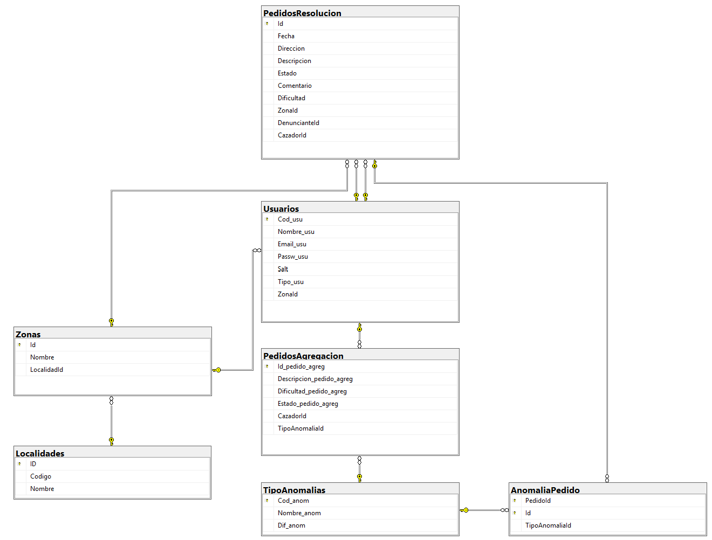
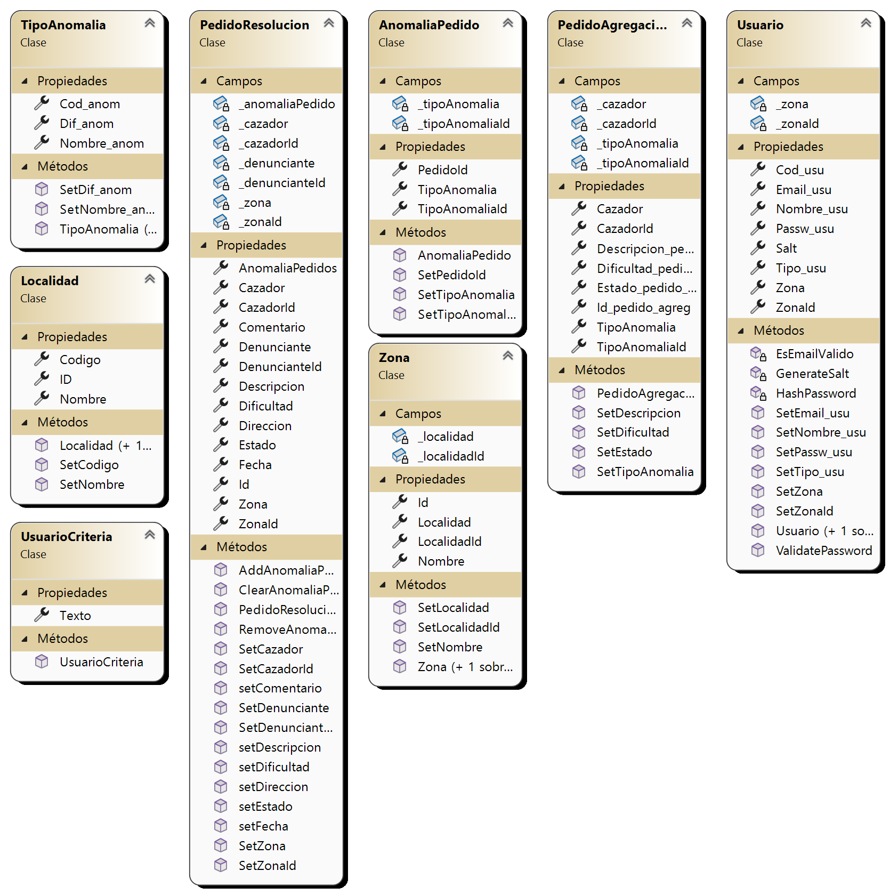

# Tecnologías de Desarrollo de Software IDE (.NET) - Trabajo Práctico 2025

## Integrantes

- Tomasino, Alvaro
- Aronson, Melina
- Aguilera, Tomas

## Repositorio

[Link a la app](https://github.com/tomasinoalvaro48/NET_TP_2025)

## Descripción del Sistema

Ver [TrabajoPracticoIntegrador-ResolucionDeAnomalias.pdf](TrabajoPracticoIntegrador-ResolucionDeAnomalias.pdf)

#### Resolución de anomalías

En el país están ocurriendo Anomalías producidas por Fantasmas. Para solucionarlo, se crea un sistema capaz de asignar Avistamientos de Anomalías a Cazadores. Estos Avistamientos son cargados al sistema por un Denunciante, que se registra y genera un Pedido de Resolución, donde detalla la/s Anomalía/s y el lugar del avistamiento. Luego, el Cazador acepta un Pedido de Resolución, según su localidad y su zona y, una vez resuelto, lo finaliza.

## Modelo de Datos

## Modelo de Memoria

